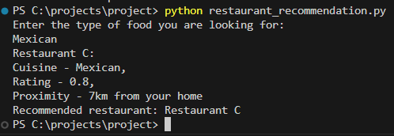
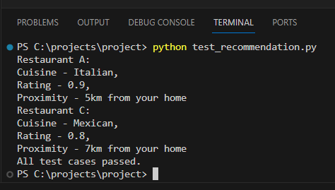

# Restaurant Recommendation System

The Restaurant Recommendation System is a simple Python program that helps users find restaurants based on their cuisine preferences. The system considers the cuisine type, restaurant rating, and proximity to provide recommendations.

## Table of Contents

- [Features](#features)
- [Usage](#usage)
- [Run](#run)
- [Test](#test)

## Features

- **Cuisine Filtering**: Users can input a preferred cuisine, and the system will filter restaurants based on that cuisine.
- **Sorting**: The system sorts the filtered restaurants based on ratings (ascending) and proximity (descending).
- **User Interaction**: Users can run the recommendation system by providing input through the command line.

## Usage

To use the Restaurant Recommendation System, follow these steps:

1. Clone the repository:

   ```bash
   git clone https://github.com/arafah-dhrubo/restaurant-recommendation-system.git
   cd restaurant-recommendation-system
   ```
2. Run the system:
    ```bash
    python restaurant_recommendation.py
    ```
## Run
1. Input: Enter the type of food you are looking for when prompted.
    ```bash
    mexican
    ```
2. Output: View the recommended restaurant based on your input.
    ```bash
    Restaurant C: 
    Cuisine - Mexican, 
    Rating - 0.8, 
    Proximity - 7km from your homr
    Recommended restaurant: Restaurant C
    ```
    
## Test
Run the test cases:
```bash
python test_recommendation.py
```  
